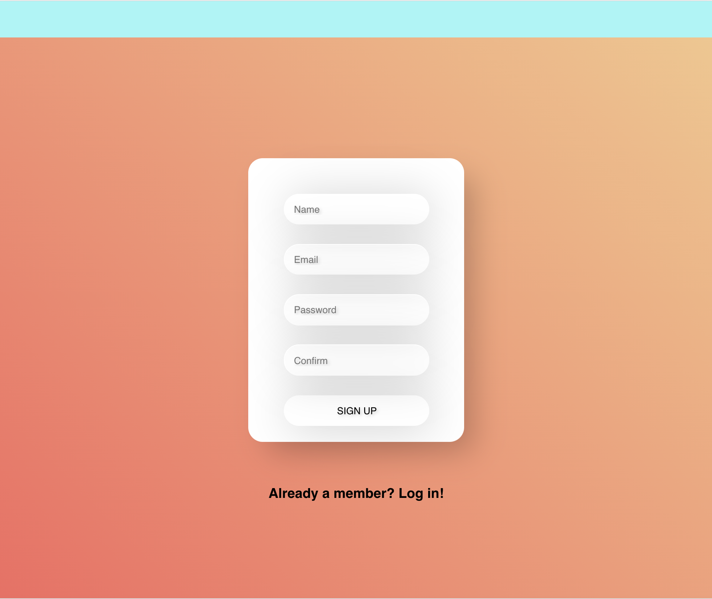
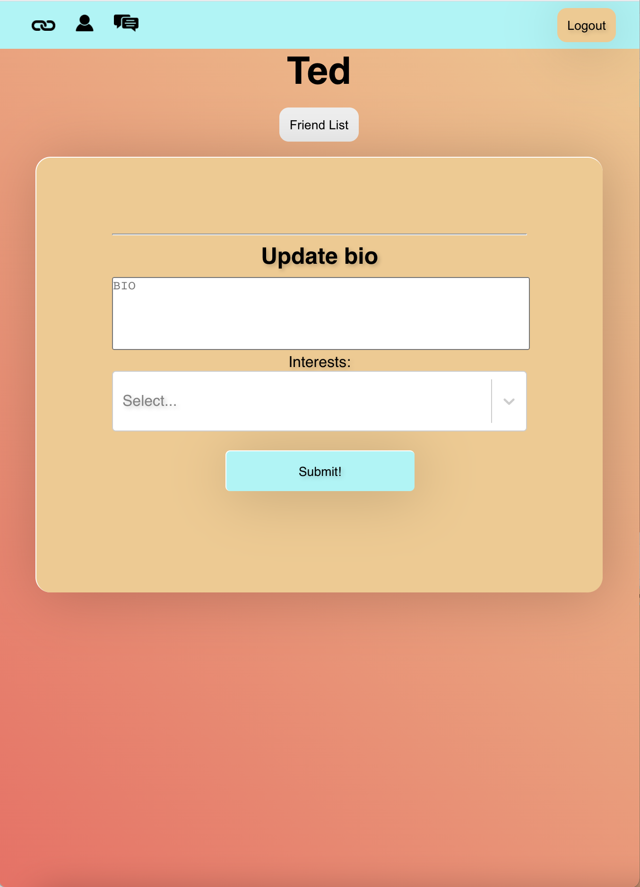
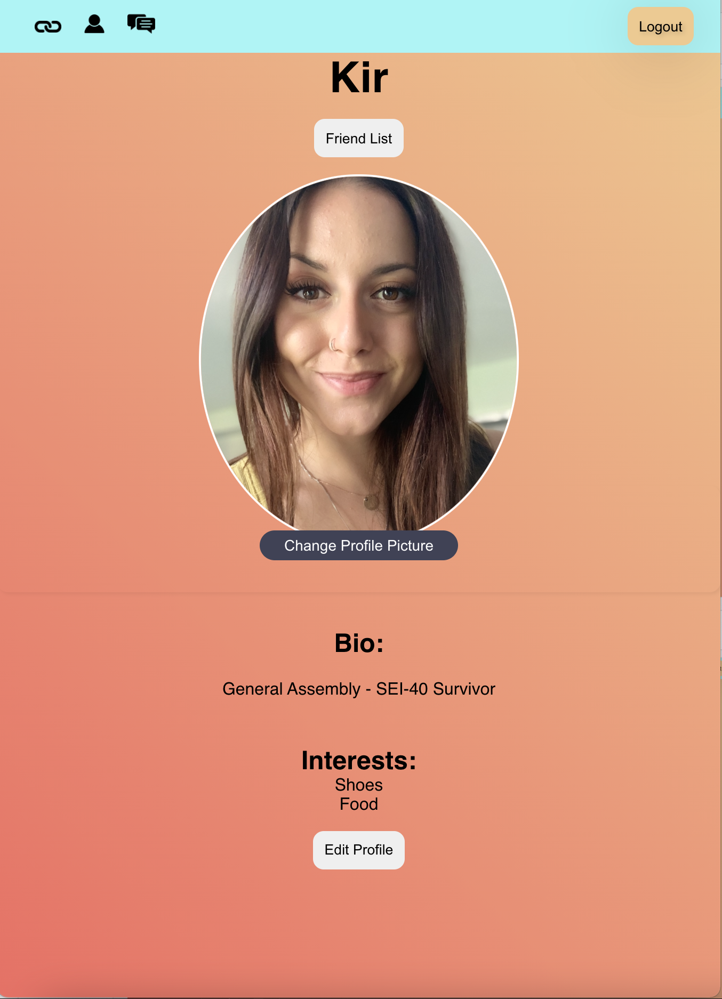
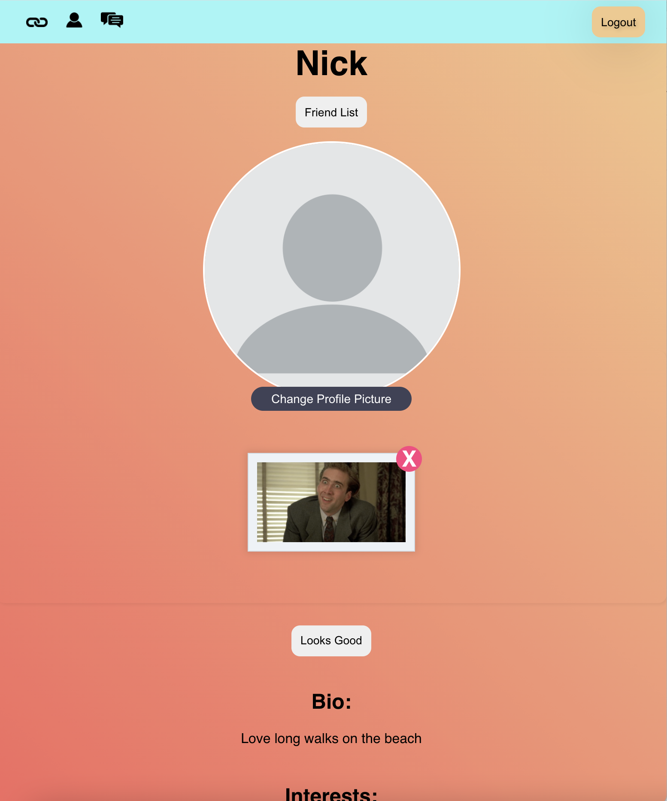
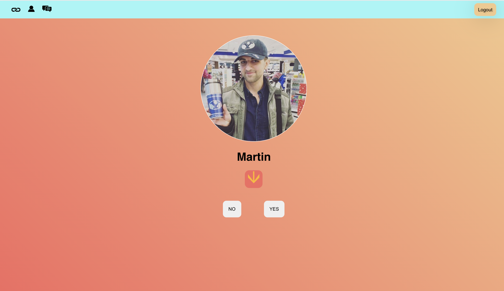
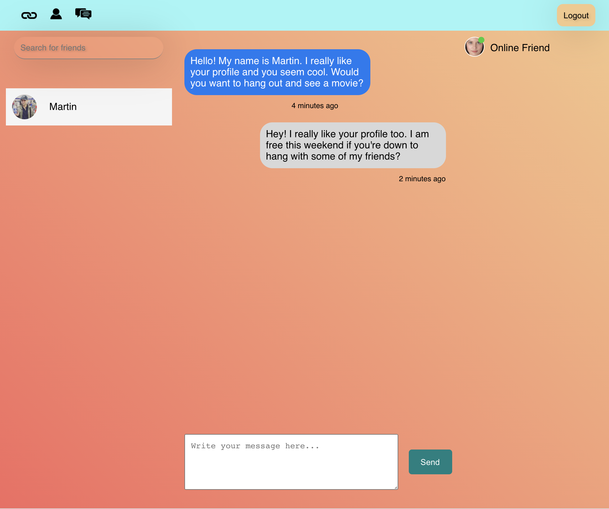

# friendl-y

> Why make friends in the old fashioned way. Use friend-ly!


### Overview 

```

What are you waiting for??

- Sign Up
- Create a Profile
- Find Friends
- Get Connecting!!!!


```


### Screenshots

<table>
  <tr>
    <td>Sign Up Form</td>
    <td>Edit</td>
    <td>Profile</td>
    
  </tr>
  <tr>
    <td></td>
    <td></td>
    <td></td>
    
  </tr>
<tr>
    <td>Upload Photo</td> 
    <td>Decision Page</td> 
    <td>Chat</td>
    
  </tr>
  <tr>
    <td></td>
    <td></td>
    <td></td>
  </tr>
 </table>

### Technologies Used

- HTML 
- CSS
- JS 
- Mangoose
- Express
- Node.js
- React
- Socket.io

### Getting Started 

Here is the **<a href="https://friendl-y.herokuapp.com/">link</a>** Have fun!

Here is the **<a href="https://trello.com/b/dMWyO6GQ/friendly">link</a>**  to the Trello board which includes all the planning that went into creating this beautiful app. 


### WHAT IS COMING NEXT?
- Implement real-time chatting.
- Display online friends.
- Add a "swipe" interface for picking friends.
- Some styling fixes. 

